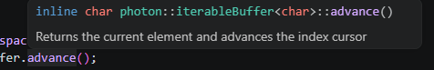

# Dev Log 1 (09/10/26) - The Photon Programming Language

Working on the lexer, i started thinking about how i want my language to look like (this will also help me design a parser later on), regardless of the environment <br>

## How i want my language to look like
### The `main()` function

The `main()` function basically tells the computer and the underlying systems where to start the program, it is usually called by a `_start()` function already provided by the compiler

```c
#include <stdio.h>
int main(void) {
    printf("Hello World\n");
    return 0; 
}
```

Which results in `Hello World` and a new command prompt, while this syntax may be familliar to everyone, i find it a little "outdated" and blocky (especially the preprocessor directive)

Let's take a look at C# and Rust for the same purpose

```csharp
using System; // considering you don't have a global using

class Program {
    static void Main(string[] args) {
        Console.WriteLine("Hello World !!");
    }
}
```

```rust
fn main() {
    println!("Hello World !");
}
```

My ideas are the following :

### 1 : Main Function
```
func main() : void {
    // Some freestanding code
}
```

### 2 : A custom entrypoint
```
entrypoint () : void {
    // Some freestanding code
}
```
The second option would make an anonymous entrypoint for the code to start <br>
To be easily executable, the default name of an anonymous entrypoint is `_start()`

If you do this :

```
entrypoint e1() : i8 {
    // Some code
    return 0;
}

entrypoint e2() : i8 {
    // Some code
    return 0;
}
```

Multiple entrypoints are defined, you can, using this (since this language compiles to LLVM), give multiple entry points an assembly code, and select which one to trigger, example with the following bootloader

```x86asm
[bits 16]
[org 0x7c00]

; Extern symbols
extern e1 ; entrypoint e1()
extern e2 ; entrypoint e2()

start:
    mov al, 1 ; we want to trigger e2

    ; comparison with a JUMP EQUAL flag condition
    cmp al, 0
    je trig_e1

    cmp al, 1
    je trig_e2

    ; if none, stops locks the cpu
    jmp halt

trig_e1:
    call e1
    jmp halt

trig_e2:
    call e2
    jmp halt

halt:
    cli ; disables interruptions
    hlt ; locks the CPU
    jmp halt ; infinite loop (while (true))

; Bootloader signature
times 510-($-$$) db 0
dw 0xaa55
```

## Defining our lists

We will define two lists : <br>
1. A keyword list as `std::vector<std::string>`
2. A symbol list as `std::vector<char>`

Our keywords list is now the following :
```cpp
// File : reservedEntries.hpp

#ifndef RESERVED_ENTRIES_HPP
#   define RESERVED_ENTRIES_HPP

#include <vector>

namespace photon {
    const std::vector<std::string> reservedKeywords = {
        // Declarations
        "entrypoint"
    };
} // namespace photon

#endif
```

We can also add a new vector containing the symbols :
```cpp
// File : reservedEntries.hpp

#ifndef RESERVED_ENTRIES_HPP
#   define RESERVED_ENTRIES_HPP

#include <vector>

namespace photon {
    const std::vector<std::string> reservedKeywords = { /* entries */ };

    const std::vector<char> symbols = {
        // Coupled symbols
        '{', '}',
        '(', ')',

        // Operators
        ':',

        // Markers
        ';',
    };

} // namespace photon

#endif
```

## Plugging in the algorithm

We can start looking for those entries in our lexer and ignore the rest in our lexing algorithm `photon::applyLexerPass()`

Find the header of the Lexer in `include/translation/pLexer.hpp`

```cpp
// File : pLexer.cpp

#include "translation/pLexer.hpp"

namespace photon {
    void pLexer::applyLexerPass() {
        if (charBuffer.isEmpty()) {
            auto logFrame = pLogger::buildFrame
            (
                IdPrefix::LEXER_LOG, SeverityPrefix::ERR, 0x02, 
                {"Empty char buffer, will not resume lexing process"}
            );

            pLogger::lprint(logFrame);
            tokenBuffer.addElement({lineNo, colNo, TokenType::END_FILE, "EOF"}); 

            return;
        } 
            
        // Main lexing loop
        while (!charBuffer.isAtEnd()) {
            char c = charBuffer.advance();

            // Check for new lines and update the positions accordingly
            if (isNewLine(c)) { lineNo++; colNo++; }

            // [NEW] : Check for identifiers and keywords
            // Those elements follows the regex rule _[a-zA-Z0-9]*
            if (isLetter(c) || c == '_') { tokenBuffer.addElement(readWord(c)); } 
        }

        tokenBuffer.addElement({lineNo, colNo, TokenType::END_FILE, "EOF"}); 
    }

} // namespace photon
```

Then we will write this dummy file
```
// Test file

entrypoint () : void {}
```

Let's test ! We will init the compilation process of our dummy compiler (which only has a lexer for now)

```bash
splittine@fedora:~/Projets/cppPhoton$ cmake -B build
-- Could NOT find LibEdit (missing: LibEdit_INCLUDE_DIRS LibEdit_LIBRARIES) 
-- Found LLVM 22.1.8
-- Using LLVMConfig.cmake in: /usr/lib64/cmake/llvm
-- Configuring done (0.1s)
-- Generating done (0.0s)
-- Build files have been written to: /home/splittine/Projets/cppPhoton/build

splittine@fedora:~/Projets/cppPhoton$ cmake --build build
[ 20%] Building CXX object CMakeFiles/cppPhoton.dir/src/main.cpp.o
/home/splittine/Projets/cppPhoton/src/main.cpp: In function « int main(int, char**) »:
/home/splittine/Projets/cppPhoton/src/main.cpp:20:17: warning: une comparaison avec une chaîne littérale produit un résultat non spécifié [-Waddress]
   20 |     if (argv[0] == "build") {
      |         ~~~~~~~~^~~~~~~~~~
/home/splittine/Projets/cppPhoton/src/main.cpp:24:17: warning: une comparaison avec une chaîne littérale produit un résultat non spécifié [-Waddress]
   24 |     if (argv[0] == "help") {
      |         ~~~~~~~~^~~~~~~~~
[ 40%] Linking CXX executable cppPhoton
[100%] Built target cppPhoton

splittine@fedora:~/Projets/cppPhoton$ ./build/cppPhoton tests/main.pho
[ Thu Sep 10 23:31:49 2026
- (ID: 0x1101) ] : Preprocessor pass done on file "tests/main.pho" and sent it to "tests/main.ppf"
{TYPE : 0, AT : {3, 13}, LEXEME : entrypoint } 
{TYPE : 0, AT : {3, 17}, LEXEME : void } 
{TYPE : 6, AT : {3, 17}, LEXEME : EOF}
```

We see that our lexer is working ! But is has one problem :(

```
[ Thu Sep 10 23:31:49 2026 - (ID: 0x1101) ] : Preprocessor pass done on file "tests/main.pho" and sent it to "tests/main.ppf"

{TYPE : 0, AT : {3, 13}, LEXEME : entrypoint } 
{TYPE : 0, AT : {3, 17}, LEXEME : void } 
{TYPE : 6, AT : {3, 17}, LEXEME : EOF} 
```

If we look into the token types, which are defined in this enum
```cpp
// File : pToken.hpp
enum class TokenType {
    // Literals
    IDENTIFIER,     // 0
    STRING,         // 1
    CHAR,           // 2
    NUMBER,         // 3

    // Structural
    KEYWORD,        // 4
    SYMBOL,         // 5

    // Delimitations
    END_FILE        // 6
};
```

The entry `entrypoint` is defined as a keyword, it should be a type `TokenType::KEYWORD` or `4`, but it reports as an identifier ! Why ? Let's find out <br>

The problem clearly lies in the call to `readWord()`, let's go to its definition
```cpp
// File : pLexer.hpp
#ifndef P_LEXER_HPP
#   define P_LEXER_HPP

/* includes */

namespace photon {
    // code snippet
    /**
     * Reads a word starting from the first character until the next whitespace or symbol and returns a token
     * @param begin The first character to begin from
     * @return A keyword token if the lexeme belongs to the keyword list, an identifier otherwise
    */
    Token readWord(char& begin) {
        std::string lexeme;
        char c = begin;
        lexeme += c;
            
        while (!isWhitespace(c) && !isSymbol(c)) {
            c = charBuffer.advance();
            lexeme += c;
            colNo++;
        }

        // Checks if the lexeme refers to a known keyword
        if (isItemRefPresentIn(lexeme, reservedKeywords)) {
            return {lineNo, colNo, TokenType::KEYWORD, lexeme};
        }

        return {lineNo, colNo, TokenType::IDENTIFIER, lexeme};
    }
}

#endif
```

I have one issue in mind that can be the problem, **a stray space is messing with the reading**

As we can see in our output :
```bash
{TYPE : 0, AT : {3, 13}, LEXEME : entrypoint } # Space
{TYPE : 0, AT : {3, 17}, LEXEME : void }       # Space
{TYPE : 6, AT : {3, 17}, LEXEME : EOF}         # No space
```

The word based lexemes have a whitespace in them that when passed to
`isItemRefPresentIn(lexeme, reservedKeywords)`, can make it return false <br>
The function declaration is the following :
```cpp
// File : vectorUtilities.hpp

#ifndef VEC_UTILS_HPP
#   define VEC_UTILS_HPP

#include <vector>
#include <algorithm>

namespace photon {

    // code snippet

    /** 
     * Asserts that an element is present in a vector (pass by reference)
     * @param item The item to look for
     * @param vec The vector to check into
    */
    template<typename T>
    bool isItemRefPresentIn(T& item, const std::vector<T>& vec) {
        return (std::find(vec.begin(), vec.end(), item) != vec.end());
    }
} // namespace photon

#endif // VEC_UTILS_HPP
```

Let's confirm that by adding a whitespace in our keyword vector and recompile
```cpp
const std::vector<std::string> reservedKeywords = {
    // Declarations
    "entrypoint " // [NEW] : Added space
};
```

After compiling, our output confirms the theory
```bash
{TYPE : 4, AT : {3, 13}, LEXEME : entrypoint } 
{TYPE : 0, AT : {3, 17}, LEXEME : void } 
{TYPE : 6, AT : {3, 17}, LEXEME : EOF} 
```

This time the type is `4`, which refers to `TokenType::KEYWORD` <br>
We have two solutions to solve this, one is cheap, the other is durable, we could strip the stray whitespace of the readen lexeme, or we can simply not include it <br>
Let's go check the reading loop and apply the second solution

```cpp
Token readWord(char& begin) {
    /* declaration section */
            
    while (!isWhitespace(c) && !isSymbol(c)) {
        c = charBuffer.advance();
        lexeme += c;
        colNo++;
    }

    /* return section */
}
```

I consider looking at the `advance()` function (which i made myself) that has the following description 

Let's trace some execution and debug using good old `std::cout` statements, i have a feeling that it returns the whitespace before checking the condition `!isWhitespace()`

```cpp
Token readWord(char& begin) {
    /* declaration section */
            
    while (!isWhitespace(c) && !isSymbol(c)) {
        c = charBuffer.advance(); // The first char will be ignored by the debug because we know what it is

        // [NEW] Debugging Section
        std::cout << "[NEW ENTRY] "
                  << "Current char : " << c << ", "
                  << "Current cursor position : " << charBuffer.position() << ", "
                  << "Is whitespace ? " << (isWhitespace(c) ? "true" : "false") 
                  << '\n';

        lexeme += c;
        colNo++;
    }

    /* return section */
}
```

Upon execution, this is the output i got
```bash
[NEW ENTRY] Current char : n, Current cursor position : 4, Is whitespace ? false
[NEW ENTRY] Current char : t, Current cursor position : 5, Is whitespace ? false
[NEW ENTRY] Current char : r, Current cursor position : 6, Is whitespace ? false
[NEW ENTRY] Current char : y, Current cursor position : 7, Is whitespace ? false
[NEW ENTRY] Current char : p, Current cursor position : 8, Is whitespace ? false
[NEW ENTRY] Current char : o, Current cursor position : 9, Is whitespace ? false
[NEW ENTRY] Current char : i, Current cursor position : 10, Is whitespace ? false
[NEW ENTRY] Current char : n, Current cursor position : 11, Is whitespace ? false
[NEW ENTRY] Current char : t, Current cursor position : 12, Is whitespace ? false
[NEW ENTRY] Current char :  , Current cursor position : 13, Is whitespace ? true
[NEW ENTRY] Current char : o, Current cursor position : 20, Is whitespace ? false
[NEW ENTRY] Current char : i, Current cursor position : 21, Is whitespace ? false
[NEW ENTRY] Current char : d, Current cursor position : 22, Is whitespace ? false
[NEW ENTRY] Current char :  , Current cursor position : 23, Is whitespace ? true
{TYPE : 4, AT : {3, 13}, LEXEME : entrypoint } 
{TYPE : 0, AT : {3, 17}, LEXEME : void } 
{TYPE : 6, AT : {3, 17}, LEXEME : EOF} 
```

Whitespaces are fetched from the stream before loop condition testing, which is a problem, the solution i found was this one <br>

```cpp
// Old loop
while (!isWhitespace(c) && !isSymbol(c)) {
    c = charBuffer.advance();
    lexeme += c;
    colNo++;
}

// New loop
while (!isWhitespace(charBuffer.currentElement()) && !isSymbol(charBuffer.currentElement())) {
    c = charBuffer.advance();
    lexeme += c;
    colNo++;
}
```

Which gives me as an output
```bash
[NEW ENTRY] Current char : n, Current cursor position : 4, Is whitespace ? false
[NEW ENTRY] Current char : t, Current cursor position : 5, Is whitespace ? false
[NEW ENTRY] Current char : r, Current cursor position : 6, Is whitespace ? false
[NEW ENTRY] Current char : y, Current cursor position : 7, Is whitespace ? false
[NEW ENTRY] Current char : p, Current cursor position : 8, Is whitespace ? false
[NEW ENTRY] Current char : o, Current cursor position : 9, Is whitespace ? false
[NEW ENTRY] Current char : i, Current cursor position : 10, Is whitespace ? false
[NEW ENTRY] Current char : n, Current cursor position : 11, Is whitespace ? false
[NEW ENTRY] Current char : t, Current cursor position : 12, Is whitespace ? false
[NEW ENTRY] Current char : o, Current cursor position : 20, Is whitespace ? false
[NEW ENTRY] Current char : i, Current cursor position : 21, Is whitespace ? false
[NEW ENTRY] Current char : d, Current cursor position : 22, Is whitespace ? false
{TYPE : 4, AT : {3, 12}, LEXEME : entrypoint} 
{TYPE : 0, AT : {3, 15}, LEXEME : void} 
{TYPE : 6, AT : {3, 15}, LEXEME : EOF} 
```

We can see this time, the algorithm stops at the first space ! And the lexer outputs correctly ! <br>
This marks the end of this dev log, we have encountered our first small issue, fixed it, and now made a lexer capable of : <br>

1. Accounting for new lines
2. Reading words correctly and making a difference between a keyword and an identifier

The plan for next time : <br>

1. Adding numbers support
2. Adding single char symbol support
3. Adding multi char symbol support

------------
### End of log- Splittine