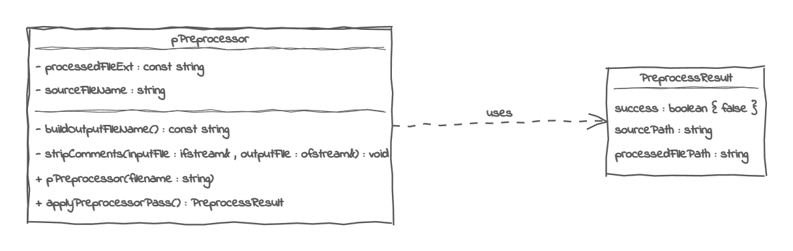

# The Photon Programming Language <br> Module 1 : The Preprocessor

The preprocessor strips away comments from a source code and performs copy and paste actions, it can also define constant macros and perform conditional compilations

## Module Infos

### *Generic Infos*
Module files : `include/translation/pPreprocessor.hpp` | `src/translation/pPreprocessor.cpp` <br>
Completion State : **DONE** - *Comments Stripping Implemented Only*

### *Class Diagram*


### *Implementation*
Private Members
```cpp
// The processed source file extension
const std::string processedFileExt = "ppf";

// The source file name to process
std::string sourceFileName;
```

Public Members
```cpp
None
```

Private Methods
```cpp
// [HELPER] Builds the processed file name
std::string buildOutputFileName() const

// [HELPER] Strips comments, has a smart algorithm to keep in string comments
void stripComments(std::ifstream& inputFile, std::ofstream& destinationFile)
```

Public Methods
```cpp
// Constructor
explicit pPreprocessor(std::string fileName) : sourceFileName(std::move(fileName)) {}
        
// Applies a preprocessor pass to the source file and builds a clean source code
PreprocessResult applyPreprocessorPass()
```