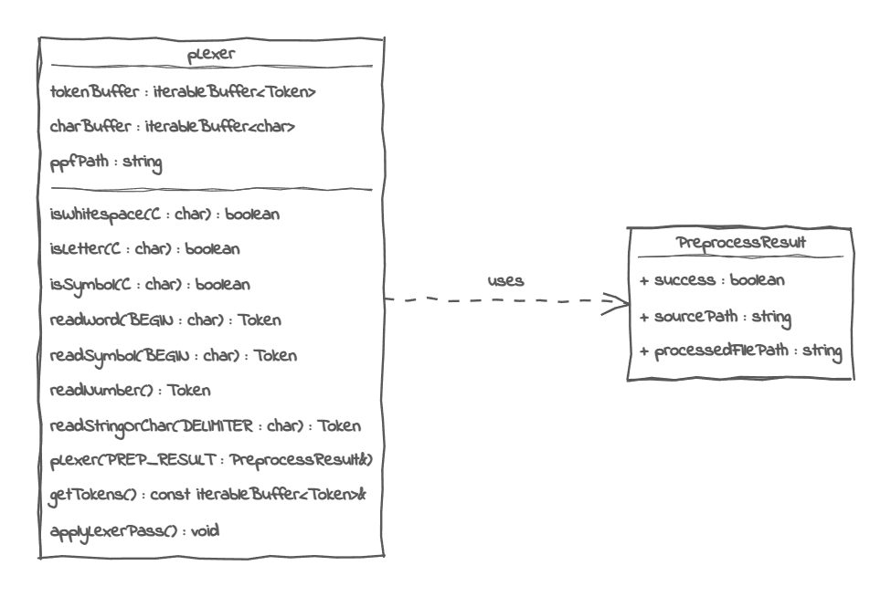

# The Photon Programming Language <br> Module 2 : The Lexer

The lexer transforms a plain source code into a list of tokens

## Module Infos

### *Generic Infos*
Module files : `include/translation/pLexer.hpp` | `src/translation/pLexer.cpp` <br>
Completion State : **DONE**

### *Class Diagram*


### *Implementation*
Private Members
```cpp
// The array of processed tokens
iterableBuffer<Token> tokenBuffer;

// The char array containing the processed text file
iterableBuffer<char> charBuffer;

// The path to the processed photon script file
std::string ppfPath;
```

Public Members
```cpp
None
```

Private Methods
```cpp
/**
 * Asserts that the given character is a valid whitespace character (' ', \\n, \f, \r, \t and \v)
 * @param c The given character
*/
bool isWhitespace(const char C);

/**
 * Asserts that the given character is a letter
 * @param c The given character
*/
bool isLetter(const char C);

/**
 * Asserts that the given character is a symbol
*/
bool isSymbol(const char C);

/**
 * Reads a word starting from the first character until the next whitespace or symbol and returns a token
 * @param BEGIN The first character to begin from
 * @return A keyword token if the lexeme belongs to the keyword list, an identifier otherwise
*/
Token readWord(const char BEGIN);

/**
 * Reads a symbol from the first character until the next non symbol character and returns a token
 * @param BEGIN The first character to begin from
*/
Token readSymbol(const char BEGIN);

/**
 * Reads a number from the first character until the next non number character and returns a token
*/
Token readNumber();

/**
 * Reads a string value or char value between two matching delimiters
 * @param DELIMITER The symbol that delimits the value
*/
Token readStringOrChar(const char DELIMITER);
```

Public Methods
```cpp
// Constructor
explicit pLexer(const PreprocessResult& PREP_RESULT);

/** Returns the token list as an immutable reference */
const iterableBuffer<Token>& getTokens() const;

/** Transforms the cleaned source file into a stream of tokens */
void applyLexerPass();
```